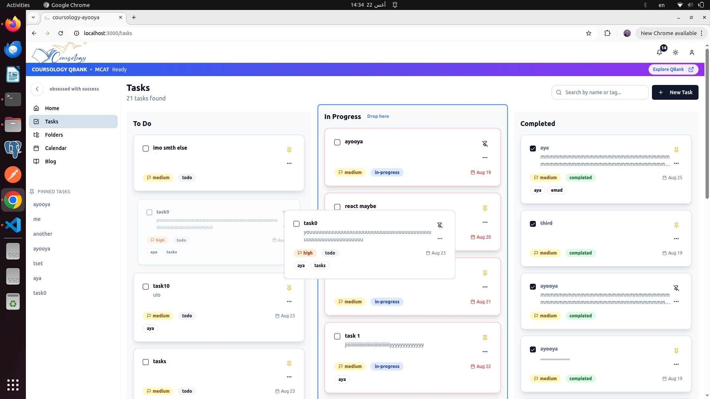
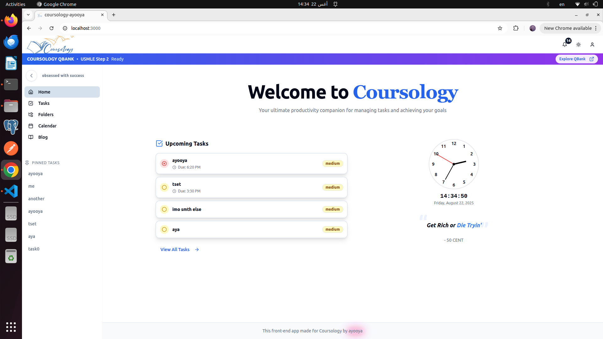
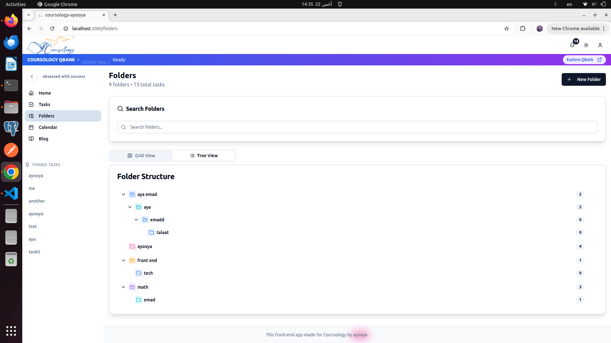
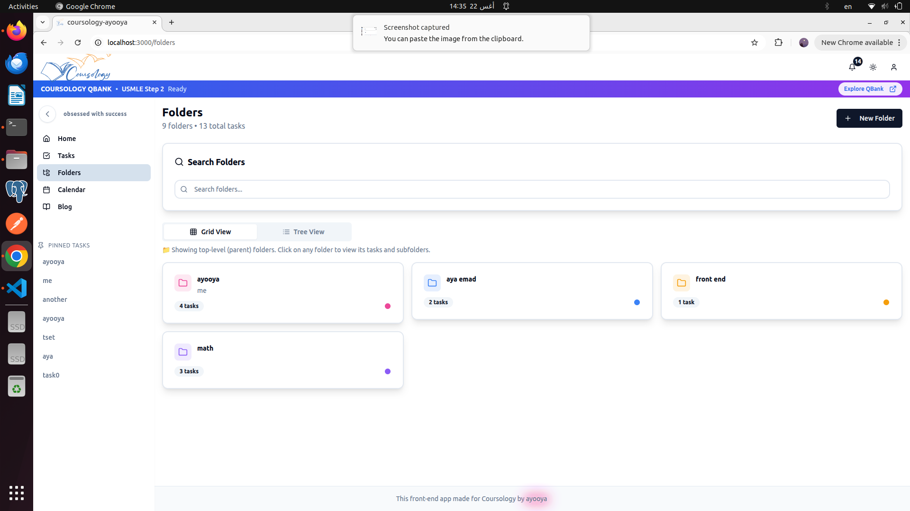
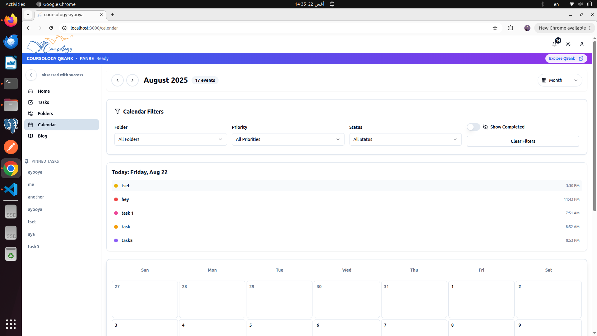
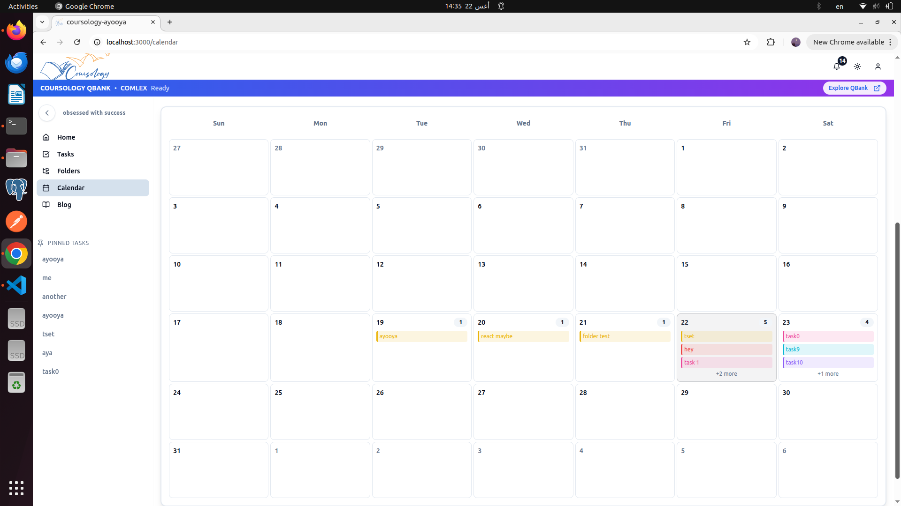
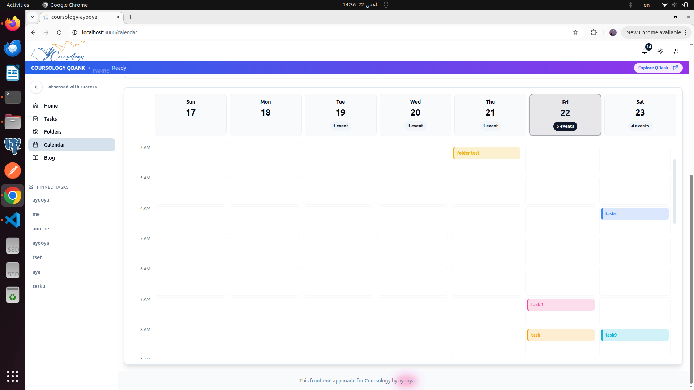
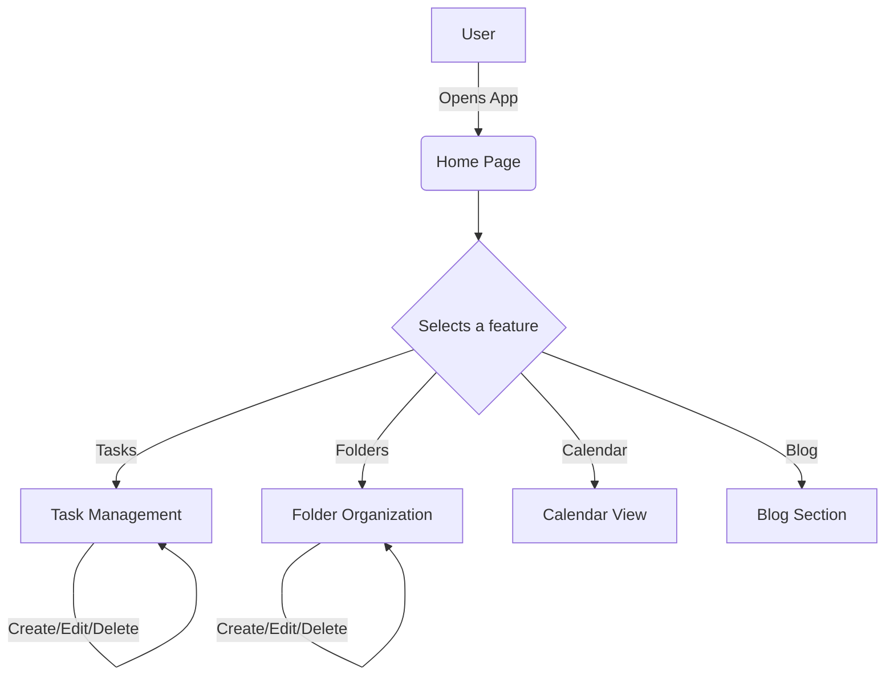

# Coursology Todo App


A powerful and intuitive todo application designed to help you stay organized and productive.

## 🚀 Introduction

The Coursology Todo App is a feature-rich task management solution built with Next.js, TypeScript, and Tailwind CSS. It provides a seamless and visually appealing experience for managing your tasks, organizing them into folders, and visualizing your schedule with a built-in calendar.

## 💻 Codebase Overview

This project is built with a focus on modularity, scalability, and developer experience. We use a combination of modern technologies to create a robust and maintainable codebase. For a deeper dive into our architecture, components, and state management, check out our detailed code documentation.

[Read the Code Documentation](./docs/CODE_DOCUMENTATION.md)

## 🚀 Live Demo

You can try out the live application here:

[https://coursology-todo-appp.vercel.app/](https://coursology-todo-appp.vercel.app/)

## 📸 Screenshots

Here are some screenshots of the application. We also have a dark mode - try the app to see it!

### Home Page


### Folders (Tree View)


### Tasks


### Folders (Grid View)


### Calendar (Month View)


### Calendar (Week View)


### Blog


## ✨ Features

*   **Task Management:** Create, edit, delete, and track your tasks with ease.
*   **Folder Organization:** Group your tasks into folders for better organization.
*   **Calendar View:** Visualize your tasks in a weekly or monthly calendar view.
*   **Blog:** A dedicated section for articles and updates.
*   **Notifications:** Stay informed with in-app notifications.
*   **Responsive Design:** A beautiful and responsive UI that works on all devices.
*   **Themeable:** Light and dark mode support.

## 🏁 Getting Started

To get a local copy up and running, follow these simple steps.

### Prerequisites

*   Node.js (v18 or later)
*   pnpm

### Installation

1.  Clone the repo
    ```sh
    git clone https://github.com/ayaemx/to-do-app-.git
    ```
2.  Install NPM packages
    ```sh
    pnpm install
    ```
3.  Run the development server
    ```sh
    pnpm run dev
    ```

Open [http://localhost:3000](http://localhost:3000) with your browser to see the result.

## 🌊 Workflow Diagram



## 🔮 Future Plans

*   **Real-time Collaboration:** Allow multiple users to collaborate on tasks and projects.
*   **Advanced Filtering and Sorting:** Implement more advanced options for filtering and sorting tasks.
*   **Reminders and Due Dates:** Add support for setting reminders and due dates for tasks.
*   **Analytics and Reporting:** Provide users with insights into their productivity.
*   **Third-Party Integrations:** Integrate with other popular productivity tools.

## 🛠️ Technologies Used

*   [Next.js](https://nextjs.org/) - React Framework
*   [TypeScript](https://www.typescriptlang.org/) - JavaScript with syntax for types.
*   [Tailwind CSS](https://tailwindcss.com/) - A utility-first CSS framework.
*   [Radix UI](https://www.radix-ui.com/) - Unstyled, accessible components for building high‑quality design systems and web apps.
*   [Framer Motion](https://www.framer.com/motion/) - A production-ready motion library for React.
*   [Jest](https://jestjs.io/) - A delightful JavaScript Testing Framework.
*   [React Testing Library](https://testing-library.com/docs/react-testing-library/intro/) - Simple and complete testing utilities that encourage good testing practices.

## 🤝 Contributing

Contributions are what make the open source community such an amazing place to learn, inspire, and create. Any contributions you make are **greatly appreciated**.

1.  Fork the Project
2.  Create your Feature Branch (`git checkout -b feature/AmazingFeature`)
3.  Commit your Changes (`git commit -m 'Add some AmazingFeature'`)
4.  Push to the Branch (`git push origin feature/AmazingFeature`)
5.  Open a Pull Request

## 📄 License

Distributed under the MIT License. See `LICENSE` for more information.
